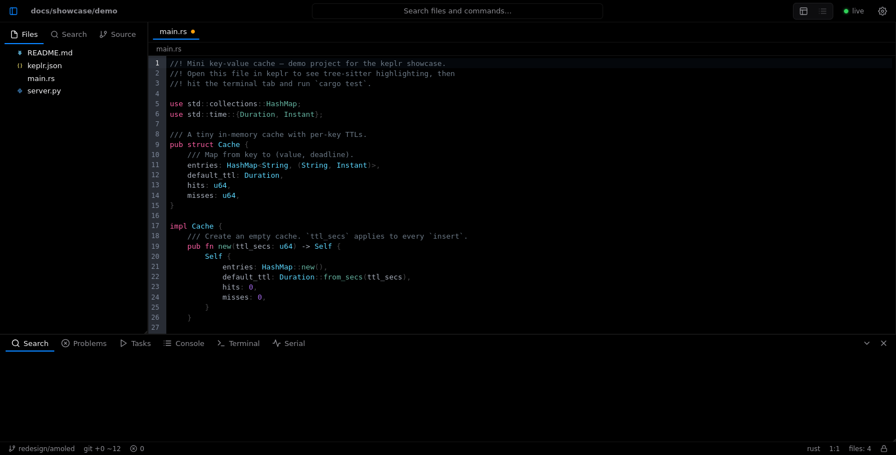
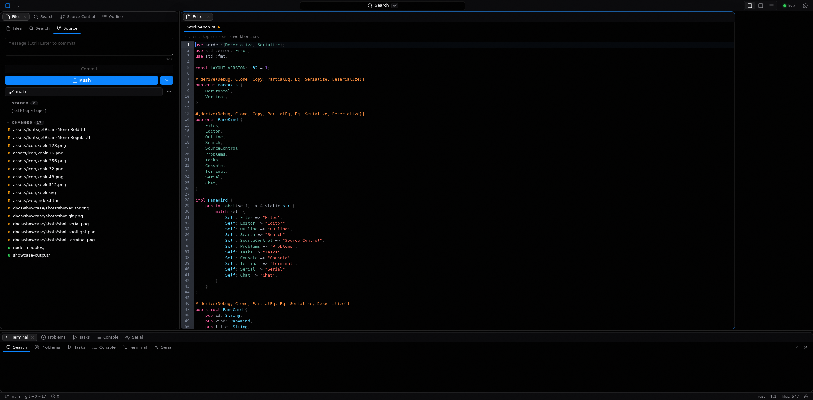
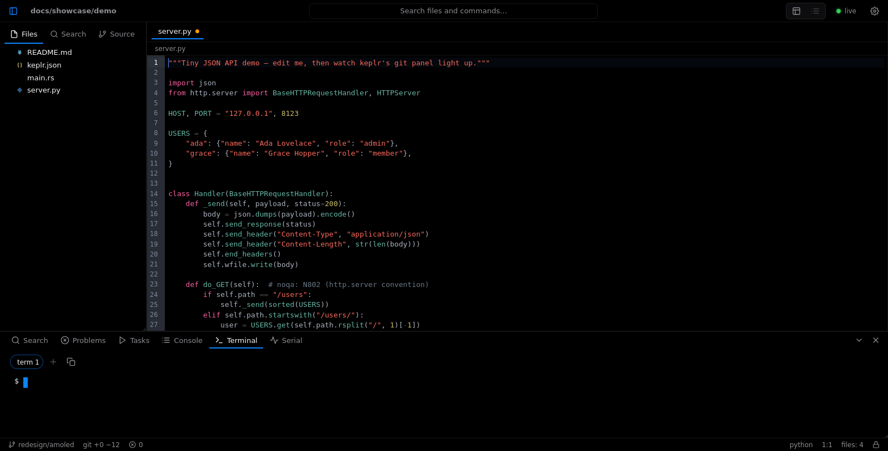
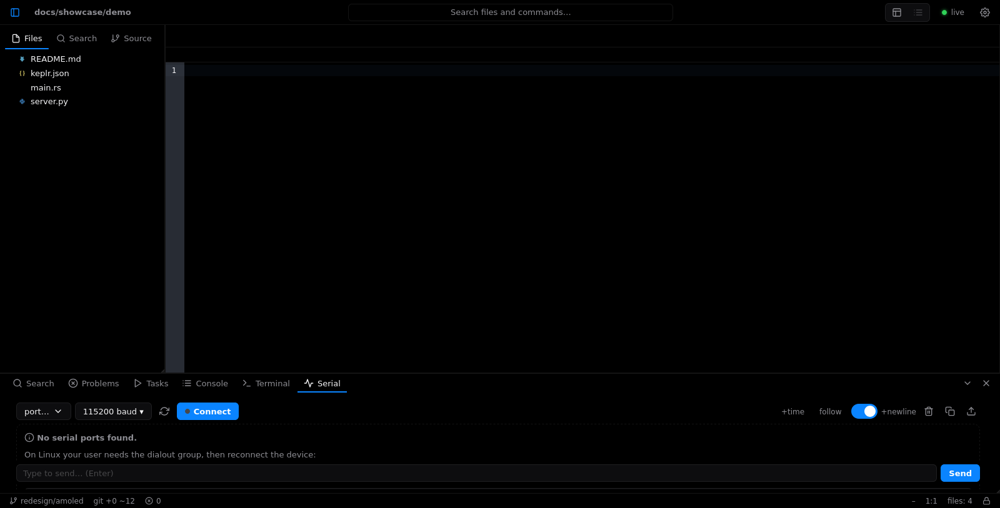

# Keplr

[](https://github.com/NaveenSingh9999/keplr/actions)
[](LICENSE)
[](https://www.rust-lang.org)
[](#install)

**A personal lightweight IDE in a single Rust binary** — tree-sitter highlighting,
a Zed-style web UI, a real PTY terminal with tabs, a serial monitor, VSCode-style
source control with one-click Push, headless `serve` + desktop + TUI from one
codebase, Git LFS aware, and CRDT sync between machines.



## Why keplr

- **One binary, 17.2 MB.** No runtime, no Electron, no `node_modules`. Copy it anywhere.
- **Starts in 43 ms.** Measured cold start (`keplr --help`, release build).
- **Use it anywhere.** Local TUI, desktop window, or `keplr serve` + any browser —
  including your phone on the same network, or a headless box over SSH.
- **Real terminals.** Every terminal tab is an independent PTY shell, painted on
  canvas — no xterm.js.
- **Hardware friendly.** Built-in serial monitor (`/dev/ttyUSB*`, `/dev/cu.*`):
  pick a port, pick a baud, talk to your board.
- **Git without the terminal.** Stage, commit, branch, stash — and Push with one click.
- **Stays in sync.** CRDT-backed sync sessions merge concurrent edits live;
  conflicts keep both sides instead of eating your work.

## Tour

**Spotlight** — `Alt+Space` (or `Ctrl+P`) opens the centered finder: files,
commands, symbols (`@`), line jumps (`:`) and content search (`#`), with Top Hit
pre-selected. Watch it in motion:

<video src="docs/showcase/shots/spotlight.mp4" width="100%" controls muted loop playsinline></video>

**Editor** — fuzzy finder (`Ctrl+P`), tree-sitter highlighting, split panes,
vim mode, diagnostics, symbols, Markdown/PDF/image previews.


**Source control** — commit box, branch picker, stage/unstage/discard, stash,
and the blue **Push** button. No terminal required.



**Terminals** — parallel independent shells in tabs (`+` to open, `×` to kill),
right inside the IDE.



**Serial monitor** — open a port at any standard baud rate, watch bytes stream in,
type back. Perfect for ESP32/Arduino/STM32 work.



## keplr vs VS Code

| | keplr | VS Code |
|---|---|---|
| Install size | **17.2 MB** single binary (measured) | Electron distribution, hundreds of MB |
| Cold start | **43 ms** (measured, release) | seconds (Electron runtime) |
| Terminal | built-in PTY tabs, no extensions | built-in terminal, one session per panel |
| Serial monitor | **built in** | needs an extension |
| Git push | **one-click button** | button in Source Control |
| Remote/headless | `keplr serve` — browser UI served directly | needs Tunnel / Server component |
| TUI mode | **yes** (`keplr edit --vim`) | no |
| Multi-device sync | **built-in CRDT sync** | Settings Sync service |
| Syntax highlighting | tree-sitter | TextMate grammars (+ tree-sitter recently) |
| Extension API | none — features are built in | huge marketplace |
| Memory footprint | one native process | Electron + extension host |

keplr is not a VS Code replacement — it is a *complement*: the tool you reach for
on servers, Chromebooks, tablets, and embedded benches, where a 17.2 MB binary
that starts in 43 ms beats an Electron install.

## Speed (measured)

Release build on Termux/aarch64, `bench --files 200 --lines 20`:

| Operation | Time |
|---|---|
| Cold start (`--help`) | **43 ms** |
| Binary size | **17.2 MB** |
| Walk 200 files | **27 ms** |
| Index 200 files | **16 ms** |
| Fuzzy match p50 | **420 µs** |
| Content grep p50 | **53 ms** |
| CAS store throughput | **52,794 puts/s** |
| Server response (localhost) | **11 ms** |
| First paint (headless test rig) | **~0.3 s** |

Reproduce: `cargo run --release -p keplr-cli -- --root /tmp/benchroot bench --files 200 --lines 20 --json`

## Install

Prebuilt binaries live on the [releases page](https://github.com/NaveenSingh9999/keplr/releases)
(first release: `v0.1.0`):

| OS | Arch | Download |
|---|---|---|
| Linux | x86_64 | `keplr_x.y.z_amd64.deb`, `keplr-x.y.z-1.x86_64.rpm`, `keplr-x.y.z-x86_64.AppImage`, or raw `keplr-x86_64-unknown-linux-gnu` |
| Linux | aarch64 | `keplr_x.y.z_arm64.deb`, `keplr-x.y.z-aarch64.AppImage`, or raw `keplr-aarch64-unknown-linux-gnu` |
| macOS | universal (arm64 + x86_64) | `Keplr-x.y.z-universal.dmg` (drag to Applications) |
| Windows | x86_64 | `Keplr-Setup-x.y.z-x86_64.exe` installer (Start Menu entries + uninstaller) |

```bash
# Debian/Ubuntu:
sudo dpkg -i keplr_0.1.0_amd64.deb
# Fedora/RHEL:
sudo rpm -i keplr-0.1.0-1.x86_64.rpm
# Any Linux: chmod +x keplr-0.1.0-x86_64.AppImage && ./keplr-0.1.0-x86_64.AppImage

# From source (Rust stable):
cargo install --git https://github.com/NaveenSingh9999/keplr.git keplr-cli
# Or build locally:
git clone https://github.com/NaveenSingh9999/keplr.git && cd keplr
cargo build --release -p keplr-cli   # → target/release/keplr

# Daemon + self-updates from inside keplr:
keplr start --name dev               # background serve on :7137
keplr list                           # running instances
keplr stop --name dev                # or --all
```

`keplr install --version latest` fetches the same prebuilt release binaries
(`keplr-{target}` assets) into `~/.keplr/bin` — no token needed, the repo is
public. On Windows add `%USERPROFILE%\.keplr\bin` to PATH.

## Quickstart

```bash
keplr --root ~/myproject serve --port 7137
# open http://127.0.0.1:7137/
#  • ?open=path&line=12   deep-link a file
#  • ?bottom=terminal      open with terminal up
#  • ?left=source          open with source control up

keplr --root . files "serve" --limit 20     # fuzzy files
keplr --root . search "broadcast" --limit 20 # trigram content search
keplr --root . run --all --jobs 4           # build DAG tasks
keplr --root . git push                     # CLI push
keplr --root . lfs ls-files                 # LFS tracking
keplr --root . sync --url ws://127.0.0.1:7137/sync/channel --name notes
```

In a Codespace: run `serve`, forward port `7137` in the **Ports** panel, open in browser.
If a token is configured (`keplr token --save`), paste it into the token box.

## Layout

```
crates/
  keplr-core    index, watcher, fuzzy/trigram search, rope buffers, git + LFS
  keplr-sync    Blake3 CAS + yrs CRDT sync
  keplr-build   keplr.json DAG task runner
  keplr-lang    tree-sitter + LSP + snippets
  keplr-serve   axum server, PTY terminals, serial bridge, browser UI
  keplr-cli     the `keplr` binary (CLI + lifecycle + self-update)
  keplr-render  GPU canvas / ANSI fallback scene builder
  keplr-ui      UI state machine   keplr-web  WASM browser entry
docs/showcase/  demo project + screenshots used above
```

Design docs live under `docs/superpowers/` (specs + plans). CI runs tests,
clippy `-D warnings`, full build, GPU/wasm checks, and macOS/Windows jobs on
every push.

## Contributing

Issues and PRs welcome. Please run before pushing:

```bash
cargo test --workspace --all-targets
cargo clippy --workspace --all-targets -- -D warnings
```

JavaScript in `crates/keplr-serve/src/ui.html` is an ES module — validate syntax with
`node --check` on the extracted script (modules reject duplicate declarations
that sloppy-mode checkers miss).

## License

MIT — see [LICENSE](LICENSE).

UI icon credits: IDE chrome from [Feather Icons](https://feathericons.com) (MIT),
file glyphs from the [Seti UI](https://github.com/jesseweed/seti-ui) file-icon set
(MIT) — both inlined into the app, no network needed.
